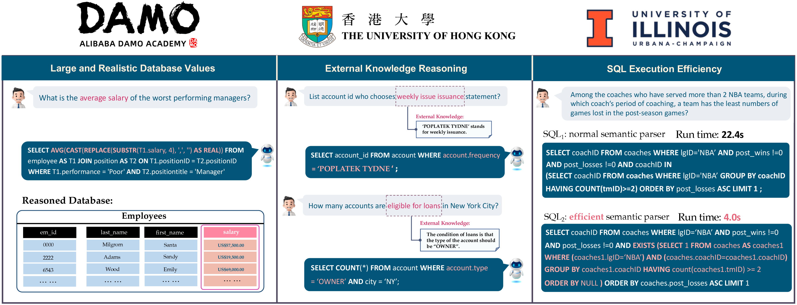

# BIRD-SQL Mini-Dev 

<p align="center">
  
</p>

<p align="center" width="100%">
  <a href="https://arxiv.org/abs/2305.03111">🔗Paper</a>
  <a href="https://bird-bench.github.io/">🏆Leaderboard</a>
<p>


[](https://creativecommons.org/licenses/by-sa/4.0/deed.en)
[](https://bird-bench.oss-cn-beijing.aliyuncs.com/minidev.zip)
[](https://www.python.org/downloads/)
[](https://bird-bench.github.io/)
[](https://pypi.org/project/openai/)
[](https://sqlite.org/download.html)
[](https://dev.mysql.com/downloads/installer/)
[](https://www.postgresql.org/download/)


<p align="center" width="100%">
<a></a>
</p>


## Overview

BIRD-SQL Mini-Dev is a lightweight dataset for evaluating LLMs on text-to-SQL tasks. It includes 500 high-quality text-to-SQL pairs from 11 databases, supporting SQLite, MySQL, and PostgreSQL dialects. The dataset helps benchmark and optimize models for SQL generation tasks.

The project provides:
- A simple framework for testing any OpenAI-compatible LLM
- Evaluation metrics: Execution Accuracy (EX), Reward-based Valid Efficiency Score (R-VES), and Soft F1-Score
- Setup scripts for multiple SQL dialects
- Comprehensive testing and evaluation tools

## Complete Setup Guide

### 1. Clone Repository

```bash
# Clone the repository
git clone https://github.com/oneconvergence/bird-bench.git
cd bird-bench
```

### 2. Set Up Python Environment

#### Option A: Using Conda (Recommended)

```bash
# Create a new conda environment with Python 3.11
conda create -n birddev python=3.11
conda activate birddev

# Install dependencies
pip install -r requirements.txt
```

#### Option B: Using Virtual Environment

```bash
# Create a virtual environment
python3.11 -m venv birddev_env
source birddev_env/bin/activate  # On Linux/macOS
# OR
birddev_env\Scripts\activate     # On Windows

# Install dependencies
pip install -r requirements.txt
```

### 3. Download and Extract Dataset

```bash
# Create directory for dataset
mkdir -p llm/dev_data

# Option A: Using wget
wget https://bird-bench.oss-cn-beijing.aliyuncs.com/minidev.zip -O minidev.zip
unzip minidev.zip -d llm/dev_data/

# Option B: Using curl
curl -L https://bird-bench.oss-cn-beijing.aliyuncs.com/minidev.zip -o minidev.zip
unzip minidev.zip -d llm/dev_data/

# Clean up zip file (optional)
rm minidev.zip
```

### 4. Verify Setup

Run the verification script to ensure everything is correctly set up:

```bash
python check_setup.py
```

This script checks:
- Python packages installation
- Dataset availability 
- SQL dialect configurations

### 5. Configure for Custom API Endpoint

#### 5.1 Configure API Base URL

Edit `llm/src/gpt_request.py` to set your API base URL:

```python
# Find this line (around line 13)
api_base = os.environ.get("API_BASE", "https://api.openai.com")

# Change it to your endpoint's base URL, for example:
api_base = os.environ.get("API_BASE", "https://your-endpoint.com")
```

#### 5.2 Configure Model and API Key

Edit `llm/run/run_gpt.sh` to set your model name and API key:

```bash
# Find these lines (around lines 10-18)
YOUR_API_KEY='' # Add your API key here before running
engine='inf-2-0-32b-sql' # Replace with your model name

# Change them to your actual values:
YOUR_API_KEY='your-actual-api-key'
engine='your-model-name'  # e.g., gpt-4, claude-3-opus, etc.
```

### 6. Run Tests with SQLite (Simplest Option)

SQLite is the easiest to start with since it doesn't require any database installation.

```bash
# Make scripts executable
chmod +x llm/run/run_gpt.sh
chmod +x evaluation/run_evaluation.sh

# Run the inference step with your model
cd llm/run
./run_gpt.sh

# Run the evaluation
cd ../../evaluation
./run_evaluation.sh
```

### 7. Check Prediction Files

After running `run_gpt.sh`, verify that prediction files are correctly created:

```bash
# Check if prediction files exist
ls -la llm/run/exp_result/sql_output_kg/

# The prediction file should follow this naming pattern:
# predict_mini_dev_[MODEL-NAME]_cot_[DIALECT].json
# For example:
# predict_mini_dev_inf-2-0-32b-sql_cot_SQLite.json
```

Important: The evaluation script (`run_evaluation.sh`) automatically detects the model name and dialect from `run_gpt.sh` and constructs the correct path to the prediction file. If you encounter any issues with file not found errors:

1. Check what path is being used in the evaluation script output:
   ```bash
   # Run with verbose output
   cd evaluation
   ./run_evaluation.sh
   # Look for the line: "Using prediction file: [PATH]"
   ```

2. If the path is incorrect, you can manually edit `run_evaluation.sh` to set the correct path:
   ```bash
   # Find this section in run_evaluation.sh (around line 30)
   predicted_sql_path="$PROJECT_ROOT/llm/run/exp_result/sql_output_kg/predict_mini_dev_${engine_name}${cot_suffix}_${sql_dialect}.json"
   
   # You can temporarily hardcode the full path if needed:
   # predicted_sql_path="/full/path/to/your/prediction/file.json"
   ```

3. The most common path issues occur when:
   - The model name in `run_gpt.sh` contains special characters or comments
   - The file was created in a different directory than expected
   - The chain-of-thought (cot) suffix is missing or differs from the expected format

### 8. Alternative: All-in-One Testing Script

For an easier experience, you can use the all-in-one testing script:

```bash
# Edit run_all_tests.sh to set your API configuration
nano run_all_tests.sh

# Add your configuration:
API_KEY="your-api-key"
MODEL_NAME="your-model-name"
API_BASE="https://your-endpoint.com"

# Make the script executable and run it
chmod +x run_all_tests.sh
./run_all_tests.sh
```

## Using Other SQL Dialects

### MySQL Setup

```bash
# Install MySQL if not already installed
# On Ubuntu/Debian:
sudo apt-get install mysql-server

# On macOS:
brew install mysql

# Setup the database
chmod +x setup_mysql.sh
./setup_mysql.sh

# Configure for MySQL (edit run_gpt.sh)
# Change these lines:
sql_dialect='SQLite' → sql_dialect='MySQL'
eval_path='./../mini_dev_data/minidev/MINIDEV/mini_dev_sqlite.json' → eval_path='./../mini_dev_data/minidev/MINIDEV/mini_dev_mysql.json'

# Run tests
cd llm/run
./run_gpt.sh
cd ../../evaluation
./run_evaluation.sh
```

### PostgreSQL Setup

```bash
# Install PostgreSQL if not already installed
# On Ubuntu/Debian:
sudo apt-get install postgresql

# On macOS:
brew install postgresql

# Setup the database
chmod +x setup_postgresql.sh
./setup_postgresql.sh

# Configure for PostgreSQL (edit run_gpt.sh)
# Change these lines:
sql_dialect='SQLite' → sql_dialect='PostgreSQL'
eval_path='./../mini_dev_data/minidev/MINIDEV/mini_dev_sqlite.json' → eval_path='./../mini_dev_data/minidev/MINIDEV/mini_dev_postgresql.json'

# Run tests
cd llm/run
./run_gpt.sh
cd ../../evaluation
./run_evaluation.sh
```

## Understanding the Results

The evaluation produces three key metrics:

1. **Execution Accuracy (EX)**: Percentage of generated SQL queries that execute correctly and return the same results as ground truth.

2. **Reward-based Valid Efficiency Score (R-VES)**: Measures the efficiency of generated SQL queries compared to ground truth, with rewards based on execution time ratio.

3. **Soft F1-Score**: Measures the similarity between the result tables of predicted and ground truth queries, allowing for column order differences and missing values.

Results are saved in the `eval_result` directory. Look for files named `predict_mini_dev_[MODEL-NAME]_cot_[DIALECT].txt`.

## Troubleshooting

### Common Issues and Solutions

1. **JSON Format Errors**: If you see errors about invalid JSON in prediction files, try:
   ```bash
   # Check file contents
   cat llm/run/exp_result/sql_output_kg/predict_mini_dev_your-model_cot_SQLite.json
   ```

2. **Database Connection Issues**:
   - SQLite: Make sure the database files exist in the correct path
   - MySQL/PostgreSQL: Check credentials in evaluation/evaluation_utils.py

3. **Path Issues**: If the evaluation script can't find prediction files:
   - Check that the paths match between run_gpt.sh output and run_evaluation.sh
   - Use `find` to locate the files:
   ```bash
   find . -name "predict_mini_dev_*.json"
   ```

4. **API Connection Errors**:
   - Verify your API key and endpoint URL
   - Test the API connection directly:
   ```bash
   curl -k -X POST "https://your-endpoint.com/your-model-name/v1/chat/completions" \
     -H "Content-Type: application/json" \
     -H "Authorization: Bearer YOUR_API_KEY" \
     -d '{
       "model": "your-model-name",
       "messages": [{"role": "user", "content": "Hello, world"}]
     }'
   ```

## Folder Structure

```
bird-bench/
├── check_setup.py               # Verifies environment setup
├── run_all_tests.sh             # Main script to run all tests
├── setup_mysql.sh               # MySQL database setup script
├── setup_postgresql.sh          # PostgreSQL database setup script
├── run_sqlite_eval.sh           # SQLite evaluation helper
├── llm/                         # LLM inference code
│   ├── run/                     # Scripts to run the inference
│   │   └── run_gpt.sh           # Main inference script
│   └── src/                     # Source code
│       ├── gpt_request.py       # API interaction code
│       ├── prompt.py            # Prompt templates
│       └── table_schema.py      # Database connection settings
├── evaluation/                  # Evaluation code
│   └── run_evaluation.sh        # Main evaluation script
└── requirements.txt             # Python dependencies
```

## Citation

```
@article{li2024can,
  title={Can llm already serve as a database interface? a big bench for large-scale database grounded text-to-sqls},
  author={Li, Jinyang and Hui, Binyuan and Qu, Ge and Yang, Jiaxi and Li, Binhua and Li, Bowen and Wang, Bailin and Qin, Bowen and Geng, Ruiying and Huo, Nan and others},
  journal={Advances in Neural Information Processing Systems},
  volume={36},
  year={2024}
}
```
